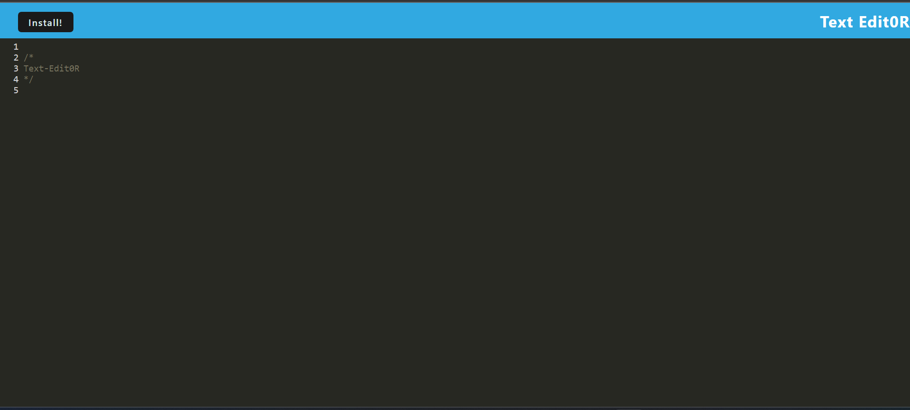
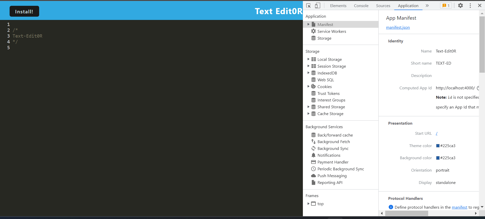
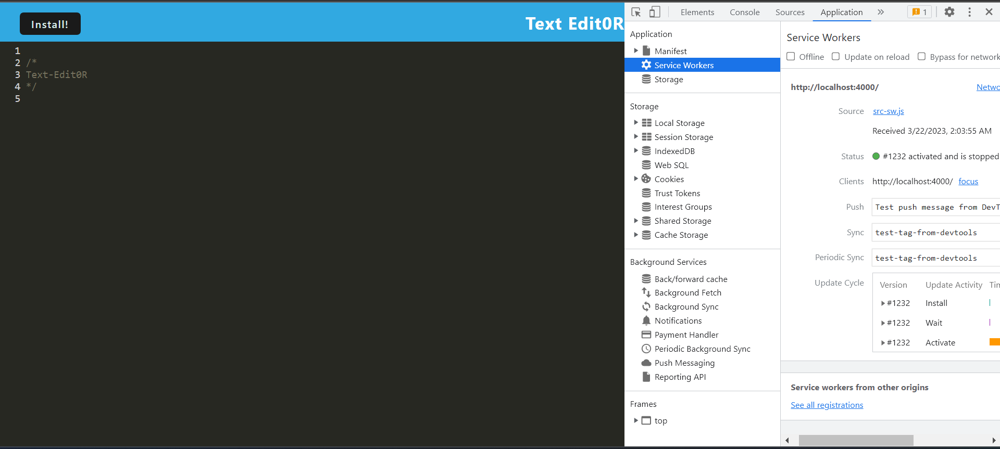

# Text-Edit0R

   
  ## Table of Contents
  - [Description](#description)
  - [Installation](#installation)
  - [Usage](#usage)
  - [Questions](#Questions)
  

  ## Description
  🔍A text editor deployed through heroku.
  
  ## Installation
  💾 Run `npm install` in order to install the following npm package dependencies.   
  💾 Run `npm start` in order to run the app in localhost.     

## Usage

  💻  Application's IndexedDB storage:
    

  💻  Application's `manifest.json` file:
    

  
  💻  Application registered service worker:
    
 

  💻  Heroku: [heroku](https://shrouded-temple-29555.herokuapp.com/) 

 ## License 
  
    
     
  ## Questions
  ✋ Feel free to contact me for any questions: 
  
  ✉️ Email: [ahmadus10@icloud.com](ahmadus10@icloud.com) 
  :octocat: GitHub: [Rana Ahmad](https://github.com/rak100)